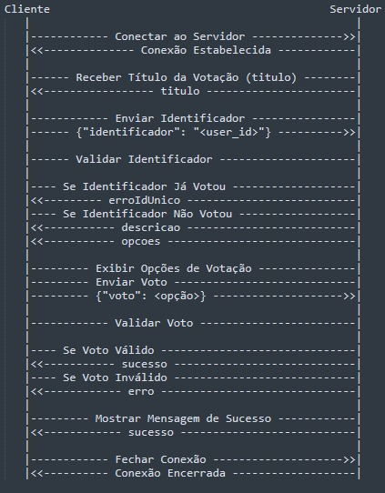

# Sistema de Votação Distribuído
Este projeto implementa um sistema de votação distribuído utilizando um modelo 
cliente - servidor. O sistema permite que os usuários votem em candidatos para o Centro Acadêmico de Ciência da Computação através de um cliente que se comunica com um servidor via sockets TCP.
  
## Autores

- Bruno Santos

- Daniel Lago

- Kauan Teles

- Vítor Coutinho

## Propósito do Software

O propósito deste software é facilitar a votação eletrônica para eleições do Centro Acadêmico, garantindo que cada usuário possa votar apenas uma vez e que os votos sejam computados de forma segura e confiável.  

## Motivação da Escolha do Protocolo de Transporte

Escolhemos o protocolo de transporte TCP por sua confiabilidade na entrega de mensagens. Em um ambiente de votação, é crucial que os votos sejam transmitidos de forma correta e completa, e o TCP fornece garantias de entrega de pacotes, ordenação e controle de fluxo que são essenciais para a integridade do processo de votação.

## Bibliotecas Utilizadas

- Socket: Permite a criação e uso de sockets para comunicação em rede (TCP/IP).

- Threading: Fornece uma maneira de criar e gerenciar threads, permitindo a execução de várias operações simultaneamente no mesmo programa.

- Tkinter: é a biblioteca padrão de interface gráfica para o Python.

- Json: Fornece métodos para codificar e decodificar dados no formato JSON (JavaScript Object Notation).

- Typing: O módulo typing fornece ferramentas para indicar tipos em Pytho de dados complexos.

- Signal: Permite definir manipuladores de sinal em Python. Sinais são uma forma de um processo notificar outro processo sobre eventos assíncronos.

## Requisitos Mínimos de Funcionamento

- Python 3.x.

- Conexão de rede para comunicação entre cliente e servidor.

- É recomendado a utilização do sistema operacional _Windows_ para evitar conflitos com a interface gráfica.

## Como Executar o projeto

O código server.py é responsável por inicializar o servidor, ou seja ao executá-lo o servidor vai ser iniciado no IP (HOST) e na Porta especificada no código.
  - Caso queira testa em localhost o IP é 127.0.0.1.
  - Caso queria executar o servidor em outra máquina o IP vai ser o Ipv4 desta máquina.

O código interface.py é responsável por executar a parte do client, lembre-se de sempre colocar o mesmo IP do servidor.

## Diagrama da Aplicação

## Descrição dos Estados

### Conexão

- O cliente se conecta ao servidor.
- O servidor aceita a conexão e a estabelece.

### Recepção do Título da Votação (titulo)

- O servidor envia o título da votação ao cliente.

### Envio do Identificador (identificador)

- O cliente envia o identificador.
- O servidor valida o identificador.
  - Se o identificador já votou, o servidor envia uma mensagem de erro (erroIdUnico).
  - Se o identificador é válido, o servidor envia a descrição da votação (descricao) e as opções de voto (opcoes).

### Exibição das Opções de Votação (descricao e opcoes)

- O cliente exibe as opções de votação.

### Envio do Voto (voto)

- O cliente envia a opção de voto escolhida.
- O servidor valida o voto.
  - Se o voto é válido, o servidor envia uma mensagem de sucesso (sucesso).
  - Se o voto é inválido, o servidor envia uma mensagem de erro (erro).

### Mensagens de Sucesso e Encerramento (sucesso)

- O cliente exibe a mensagem de sucesso.
- O servidor envia uma mensagem de agradecimento (sucesso).
- O cliente encerra a conexão.
- O servidor confirma o encerramento da conexão.
